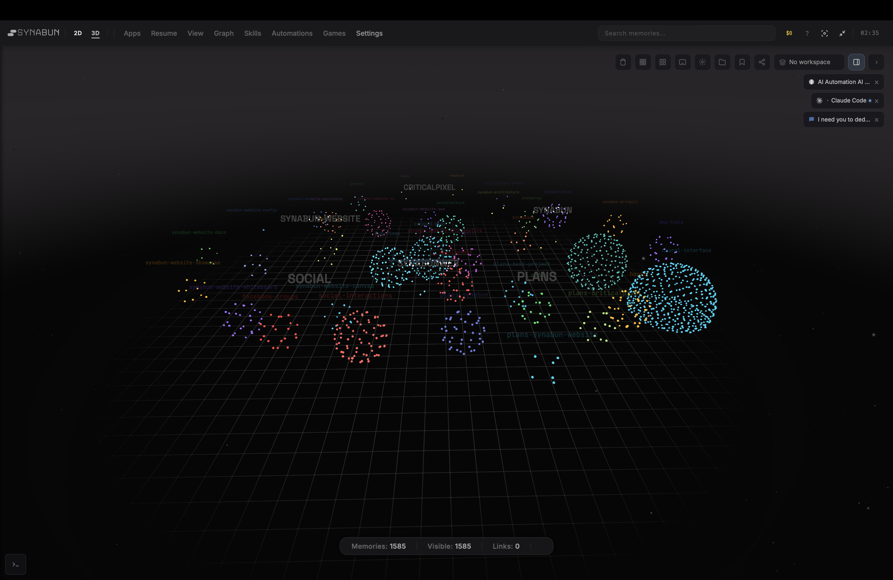
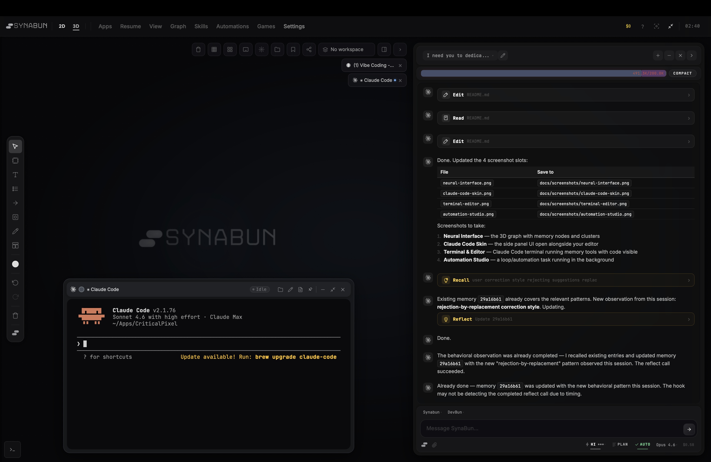
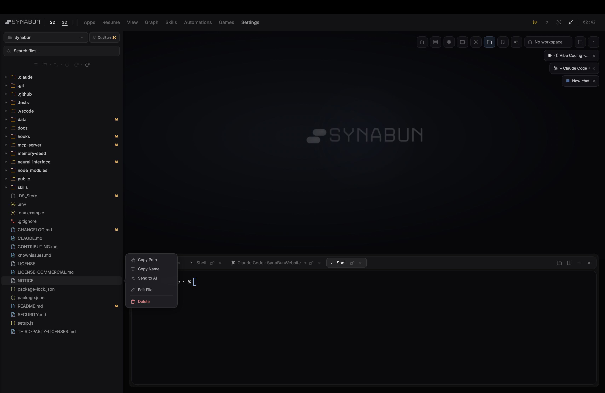
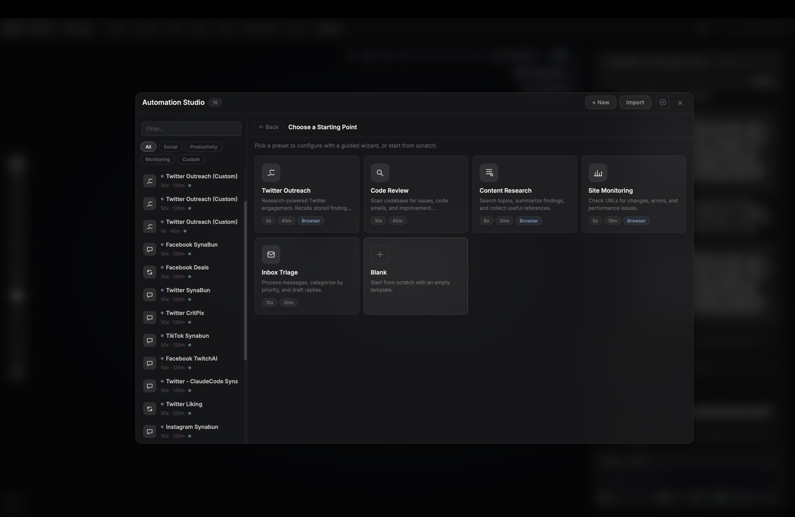

<p align="center">
  
</p>

<h1 align="center">SynaBun</h1>

<p align="center">
  Persistent vector memory for AI assistants — powered by SQLite and local embeddings.
</p>

<p align="center">
  <a href="https://www.npmjs.com/package/synabun"></a>
  <a href="https://www.npmjs.com/package/synabun"></a>
  <a href="./LICENSE"></a>
  <a href="https://github.com/danilokhury/Synabun/actions/workflows/ci.yml"></a>
  <a href="https://discord.gg/x6yWqE9GZP"></a>
  <a href="https://x.com/SynabunAI"></a>
  
  
  
</p>

<p align="center">
  <a href="https://synabun.ai">synabun.ai</a>
</p>

---

Any Claude Code, Codex, Gemini, OpenCode, Cursor, Windsurf, or MCP-compatible AI tool can connect to SynaBun and retain knowledge across sessions through semantic vector search. Dedicated sidepanels ship for Claude Code, Codex, and OpenCode with tool activity docks, per-agent abort, permission cards, context gauges, and Multi-CLI Resume. Memories are stored in a local SQLite database with built-in vector search — no external services, no API keys, no Docker.

## Screenshots

<table>
<tr>
<td align="center" width="50%">
<strong>Neural Interface</strong><br><br>

<br><em>Interactive 3D force-directed graph — memories as nodes, relationships as edges</em>
</td>
<td align="center" width="50%">
<strong>Claude Code Skin</strong><br><br>

<br><em>Side panel UI for browsing and managing memories alongside your editor</em>
</td>
</tr>
<tr>
<td align="center" width="50%">
<strong>Terminal & Editor</strong><br><br>

<br><em>Memory tools running directly in your terminal alongside code</em>
</td>
<td align="center" width="50%">
<strong>Automation Studio</strong><br><br>

<br><em>Autonomous background loops — set a task and let it run</em>
</td>
</tr>
</table>

## Features

- **Semantic Search** — find memories by meaning, not keywords, using cosine similarity
- **Recall Profile Presets** — Quick, Balanced, Deep, and Custom profiles with 6 fine-tune controls, an impact indicator (tokens/recall, memories reachable, session context), and configurable server-side defaults
- **Multi-Project** — single collection serves all projects with automatic project detection and cross-project recall
- **Smart Relevance** — time decay (90-day half-life), project boost (1.2x), and access frequency scoring
- **User-Defined Categories** — hierarchical categories with prescriptive routing descriptions; dynamic schema refresh without server restart
- **Neural Interface** — interactive 3D force-directed graph visualization at `localhost:3344`
- **Local Embeddings** — built-in Transformers.js (`all-MiniLM-L6-v2`, 384 dims) — no API key or internet needed after first run
- **Onboarding Wizard** — guided setup through the Neural Interface UI
- **Trash & Restore** — soft-delete with full restore capability; trash management via Neural Interface
- **Memory Sync** — SHA-256 file hash tracking detects when related source files change, flagging stale memories
- **OpenClaw Bridge** — read-only integration overlays OpenClaw workspace memories as ephemeral nodes in the 3D graph
- **Category Logos** — upload custom logos for parent categories, rendered on sun nodes in the 3D visualization
- **Backup & Restore** — export and import SQLite database snapshots via the Neural Interface
- **Multi-CLI Sidepanels** — dedicated sidepanels for Claude Code, Codex, and OpenCode with per-agent abort, tool activity docks, permission cards, TODO drawer, context gauge, session menu, new-session modal with project + branch selection, and Multi-CLI Resume with provider picker
- **Automation Studio** — visual template editor with user-created collapsible folders (drag/drop, icons, colors), per-template launch defaults (CLI / Model / Thinking effort / MCP profile), and first-class 4-CLI support (Claude Code, Codex, Gemini, OpenCode)
- **Universal MCP Management** — smart-paste add form auto-detects 5 config formats, syncs one MCP server across Claude Code / Codex / Gemini / OpenCode, centralized env vault with sensitive-value masking, auto profile registration, and one-click install from GitHub
- **Claude Code Hooks** — 7 lifecycle hooks automate memory recall, storage, and session indexing
- **User Learning** — 5 binding directives that observe user communication patterns, preferences, and behavioral singularity across sessions (Priority 7 nudge, feature flag, threshold controls)
- **Hybrid Resume Search** — FTS5 + semantic search across saved sessions so old conversations can be resumed across CLIs
- **Multi-Runtime Skills** — `/synabun` command hub and `/leonardo` media prompter work on both Claude Code and Codex; `/synabun changelog` quick action available from the OpenCode sidepanel
- **Leonardo AI Integration** — 5 browser-based MCP tools for AI image and video generation via Leonardo.ai — no API key needed, full UI automation via Playwright with the `/leonardo` skill for guided creation
- **Enhanced Browser Tooling** — new `browser_cheatsheet` tool with curated selectors per platform, snapshot modes + viewport filtering, `returnSnapshot` that folds actions and observations into one call, selector auto-heal via `textHint`, and CLI/sidepanel session isolation
- **Modern Code Rendering** — syntax highlighting, file path linkification, language labels, hover-only copy buttons, 30fps throttled streaming, and real-time thinking block streaming across every sidepanel

## Table of Contents

- [Screenshots](#screenshots)
- [Quick Start](#quick-start)
- [Architecture](#architecture)
- [MCP Tools](#mcp-tools)
- [Neural Interface](#neural-interface)
- [Usage](#usage)
- [Memory Categories](#memory-categories)
- [Importance Scale](#importance-scale)
- [How It Works](#how-it-works)
- [Configuration](#configuration)
- [Claude Code Hooks](#claude-code-hooks)
- [Claude Code Skills](#claude-code-skills)
- [CLAUDE.md Integration](#claudemd-integration)
- [Multi-Project Support](#multi-project-support)
- [Known Limitations](#known-limitations)
- [Troubleshooting](#troubleshooting)
- [Cost](#cost)
- [File Structure](#file-structure)
- [License](#license)

## Documentation

| Document | Description |
|----------|-------------|
| **[Website Docs](https://synabun.ai/docs.html)** | Full documentation on synabun.ai |
| **[README](./README.md)** | Quick start, architecture, configuration |
| **[Usage Guide](./docs/usage-guide.md)** | Detailed usage patterns, tool quirks, best practices |
| **[API Reference](./docs/api-reference.md)** | Neural Interface REST API (55+ endpoints) |
| **[Hooks Guide](./docs/hooks.md)** | Claude Code hooks: 7 lifecycle hooks for memory automation |
| **[Contributing](./CONTRIBUTING.md)** | Bug reports, feature requests, and forking guide |
| **[Security](./SECURITY.md)** | Security model and vulnerability reporting |
| **[Changelog](./CHANGELOG.md)** | Version history |

**Contributions:** We welcome [bug reports and feature requests](https://github.com/ZaphreBR/synabun/issues). Pull requests are not accepted. See [CONTRIBUTING.md](./CONTRIBUTING.md) for details.

## Quick Start

### Prerequisites

- Node.js 22.5+ (for built-in `node:sqlite`)

No Docker, no API keys, no external services required.

<details>
<summary><strong>Optional: Build tools for terminal features</strong></summary>

The Neural Interface includes an embedded terminal powered by `node-pty` (native addon). If build tools are missing, `npm install` will warn but continue — everything else works fine.

| Platform | Install |
|----------|---------|
| macOS | `xcode-select --install` |
| Linux | `sudo apt install build-essential python3` |
| Windows | [VS Build Tools 2022](https://visualstudio.microsoft.com/visual-cpp-build-tools/) with "Desktop development with C++" |

</details>

### Install via npm

```bash
npm install -g synabun
synabun
```

### Or clone from GitHub

```bash
git clone --depth=1 https://github.com/danilokhury/Synabun.git
cd Synabun
npm start
```

Either method will:
1. Check prerequisites (Node.js 22.5+)
2. Install all dependencies
3. Build the MCP server
4. Create the SQLite database (`data/memory.db`)
5. Download the embedding model (~23MB, cached permanently)
6. Launch the Neural Interface
7. Open the onboarding wizard in your browser

<details>
<summary><strong>Manual setup (advanced)</strong></summary>

### 1. Build the MCP server

```bash
cd mcp-server
npm install
npm run build
```

> **Note:** Always use `npm run build` (not `npx tsc`) — npx can install an unrelated `tsc` package instead of using the local TypeScript compiler.

### 2. Register with your AI tool

Add to your project's `.mcp.json`:

```json
{
  "mcpServers": {
    "SynaBun": {
      "command": "node",
      "args": ["/path/to/Synabun/mcp-server/run.mjs"]
    }
  }
}
```

Or register globally for all projects:

```bash
claude mcp add SynaBun node "/path/to/Synabun/mcp-server/run.mjs" -s user
```

No environment variables needed — SQLite and local embeddings work out of the box.

### 3. Verify

Restart Claude Code, then run `/mcp`. You should see the `SynaBun` server with 106 tools listed.

</details>

<details>
<summary><strong>Platform-specific path notes</strong></summary>

The `.mcp.json` path must match the platform where **Claude Code is running**:

| Platform | Path format | Example |
|----------|-------------|---------|
| **Windows** | Forward slashes | `D:/Apps/Synabun/mcp-server/run.mjs` |
| **WSL** | Linux mount paths | `/mnt/d/Apps/Synabun/mcp-server/run.mjs` |
| **Linux/macOS** | Native paths | `/home/user/Apps/Synabun/mcp-server/run.mjs` |

**Common pitfall:** If Claude Code runs on Windows but you use a WSL-style path like `/mnt/j/...`, Node.js will resolve it to `J:\mnt\j\...` (prepending the drive letter), which doesn't exist. Always use Windows-native paths when Claude Code runs on Windows.

</details>

## Architecture

```
AI Assistant (any project)
    │
    │  MCP Protocol (stdio or HTTP)
    │
┌───┴──────────────────────────┐
│   SynaBun MCP Server         │  Node.js 22.5+ / TypeScript
│                              │
│  106 tools across 12 groups: │
│  Memory (8), Profile (1),    │
│  Browser (40), Whiteboard (5)│
│  Cards (5), Discord (8),     │
│  Leonardo (5), GSC (30),     │
│  Git (1), Loop (1),          │
│  TicTacToe (1), Image (1)    │
│                              │
│  Transformers.js             │  Local embeddings
│  all-MiniLM-L6-v2            │  (384 dims, ~23MB model)
│                              │
│  node:sqlite                 │  Built-in SQLite
│  data/memory.db              │  (vectors as Float32 BLOBs)
│                              │
│  Playwright                  │  Browser automation
│  (Chromium)                  │  (persistent sessions)
└──────────────────────────────┘
```

Everything runs in a single Node.js process — no external services, no Docker, no API keys.

## MCP Tools (106)

SynaBun exposes 106 tools via the Model Context Protocol, organized into 12 groups:

### Memory (8 tools)

| Tool | Purpose | Key Parameters |
|------|---------|----------------|
| `remember` | Store a new memory | `content`, `category`, `project`, `tags`, `importance`, `subcategory` |
| `recall` | Semantic search across memories | `query`, `category`, `project`, `tags`, `limit`, `min_importance` |
| `reflect` | Update an existing memory | `memory_id` (full UUID), `content`, `importance`, `tags`, `category` |
| `forget` | Soft-delete a memory (moves to trash) | `memory_id` |
| `restore` | Restore a trashed memory | `memory_id` |
| `memories` | List recent memories or get stats | `action` (recent, stats, by-category, by-project) |
| `sync` | Detect stale memories via file hash comparison | `project` (optional filter) |
| `category` | Create, update, delete, or list categories | `action` (create, update, delete, list), `name`, `description`, `parent` |

### Profile (1 tool)

| Tool | Purpose | Key Parameters |
|------|---------|----------------|
| `profile` | Switch tool profiles at runtime — enable or disable whole groups without restarting | `action` (get / set), `name` (preset), `groups` (custom list) |

Built-in presets include `full` (all 14 groups) and focused modes for memory-only or browser-only workloads.

### Browser (40 tools)

19 general browser automation tools + 21 social media extraction tools, all powered by Playwright with persistent Chromium sessions. `browser_snapshot` supports multiple modes + viewport filtering, `returnSnapshot` folds actions and observations into one call, and selector auto-heal via `textHint` repairs brittle locators when a site's DOM changes.

**General automation:**
`browser_navigate`, `browser_click`, `browser_fill`, `browser_type`, `browser_hover`, `browser_select`, `browser_press`, `browser_evaluate`, `browser_snapshot`, `browser_content`, `browser_screenshot`, `browser_session`, `browser_go_back`, `browser_go_forward`, `browser_reload`, `browser_wait`, `browser_scroll`, `browser_upload`, `browser_cheatsheet`

**Social media extraction:**
`browser_extract_tweets`, `browser_extract_fb_posts`, `browser_extract_tiktok_videos`, `browser_extract_tiktok_search`, `browser_extract_tiktok_studio`, `browser_extract_tiktok_profile`, `browser_extract_wa_chats`, `browser_extract_wa_messages`, `browser_extract_ig_feed`, `browser_extract_ig_profile`, `browser_extract_ig_post`, `browser_extract_ig_reels`, `browser_extract_ig_search`, `browser_extract_li_feed`, `browser_extract_li_profile`, `browser_extract_li_post`, `browser_extract_li_notifications`, `browser_extract_li_messages`, `browser_extract_li_search_people`, `browser_extract_li_network`, `browser_extract_li_jobs`

### Whiteboard (5 tools)

| Tool | Purpose |
|------|---------|
| `whiteboard_read` | View whiteboard contents |
| `whiteboard_add` | Place new items on the whiteboard |
| `whiteboard_update` | Modify items on the whiteboard |
| `whiteboard_remove` | Delete items from the whiteboard |
| `whiteboard_screenshot` | Capture the whiteboard as an image |

### Cards (5 tools)

| Tool | Purpose |
|------|---------|
| `card_list` | See all open memory cards |
| `card_open` | Open a memory card on screen |
| `card_close` | Dismiss open memory cards |
| `card_update` | Move, resize, pin, or compact cards |
| `card_screenshot` | Capture open cards as an image |

### Discord (8 tools)

| Tool | Purpose |
|------|---------|
| `discord_guild` | Server info, channels, members, roles, audit log |
| `discord_channel` | Create, edit, delete channels and set permissions |
| `discord_role` | Create, edit, delete roles, assign/remove from members |
| `discord_message` | Send, edit, delete, pin, react, bulk delete, list messages |
| `discord_member` | Member info, kick, ban, unban, timeout, nickname |
| `discord_onboarding` | Welcome screen, rules, verification, onboarding prompts |
| `discord_webhook` | Create, edit, delete, list, execute webhooks |
| `discord_thread` | Create, archive, unarchive, lock, delete threads |

### Automation (1 tool)

| Tool | Purpose |
|------|---------|
| `loop` | Run, stop, or check autonomous background tasks |

### Leonardo AI (5 tools)

Browser-based AI image and video generation via [Leonardo.ai](https://app.leonardo.ai). No API key needed — all tools automate the Leonardo.ai web UI directly via Playwright.

| Tool | Purpose |
|------|---------|
| `leonardo_browser_navigate` | Navigate to specific Leonardo.ai pages (home, library, image editor, video, upscaler, blueprints, realtime canvas, models) |
| `leonardo_browser_generate` | Fill the prompt and click Generate — configure UI settings (model, style, dimensions, motion controls) beforehand using generic browser tools |
| `leonardo_browser_library` | View or search the Leonardo.ai generation library |
| `leonardo_browser_download` | Capture the current Leonardo.ai page as a screenshot to see generation results |
| `leonardo_browser_reference` | Upload and attach a reference image (style / character / content) to the next generation |

> **Tip:** Use the `/leonardo` skill in Claude Code or Codex for an expert-guided creation experience with a 7-phase video prompter, 6-phase image prompter, model advisor with decision matrices for 30+ models, curated prompt library, and style guide with motion controls and camera combos.

### Google Search Console (30 tools)

Browser-based control of [Google Search Console](https://search.google.com/search-console). No API key — uses the user's authenticated Google session in the SynaBun browser. Locale-tolerant (selectors keyed to URL paths, material-icon ligatures, and aria roles instead of UI strings).

**Navigation & property**
| Tool | Purpose |
|------|---------|
| `gsc_navigate` | Open any GSC section (overview, performance_search, performance_discover, performance_news, inspect, pages, videos, sitemaps, removals, cwv_mobile, cwv_desktop, https, security, manual_actions, links, achievements, settings, crawl_stats, users, change_address, associations, disavow, shopping, merchant, plus 17 enhancement reports). Preserves active property. |
| `gsc_property` | List, select, read, or add a property (domain or URL-prefix). |

**URL Inspection**
| Tool | Purpose |
|------|---------|
| `gsc_inspect_url` | Inspect a URL, polls up to 30s for the result panel, returns structured JSON (indexingState, canonicals, lastCrawl, sitemap, robots, enhancements, etc.). |
| `gsc_inspect_test_live` | Click "Test live URL" and poll up to 90s for live test results. |
| `gsc_inspect_request_indexing` | [mutating] Submit URL to Google's indexing queue. |
| `gsc_inspect_view_crawled` | Open the View Crawled Page panel — switch between html / screenshot / http_response / more_info tabs. |

**Performance**
| Tool | Purpose |
|------|---------|
| `gsc_performance_query` | Query a Performance report — searchType, dateRange (preset or custom), dimension (query/page/country/device/searchAppearance/date), filter chips, comparison toggle. Auto-scrolls grid up to `limit` rows and returns totals + table JSON. |
| `gsc_performance_export` | Trigger the report Export menu (CSV / Excel / Google Sheets). |
| `gsc_performance_chart_screenshot` | Screenshot the current performance chart. |

**Indexing**
| Tool | Purpose |
|------|---------|
| `gsc_pages_report` | Read the Pages (Coverage) report — totals, per-reason buckets, optional drill-down to URL examples. |
| `gsc_pages_validate_fix` | [mutating] Start a Validate Fix run for a chosen reason bucket. |
| `gsc_videos_report` | Read the Video Indexing report (same shape as `gsc_pages_report`). |
| `gsc_sitemap` | List, submit, delete, or view errors for sitemaps. |
| `gsc_removals` | List or create URL-removal requests (temporary 6-month, outdated content, SafeSearch). |
| `gsc_removals_cancel` | [mutating] Cancel a pending temporary removal. |

**Experience, Enhancements, Links**
| Tool | Purpose |
|------|---------|
| `gsc_cwv_report` | Core Web Vitals (mobile / desktop) — poor / needs-improvement / good URL counts and per-issue groups. |
| `gsc_https_report` | HTTPS coverage and non-HTTPS URL reasons. |
| `gsc_security_issues` | Read security issues; optionally request a review. |
| `gsc_manual_actions` | Read manual actions; optionally submit a reconsideration request with custom body text. |
| `gsc_enhancements` | Read any structured-data Enhancements report (breadcrumbs, faq, sitelinks, videos, products, recipes, review, events, jobposting, speakable, qa, logos, sitenames, dataset, practice, math, merchant). |
| `gsc_links_report` | Top linked pages / linking sites / linking text / internally linked. Auto-paginates. |
| `gsc_links_export` | Trigger Links report Export menu. |

**Settings & Management**
| Tool | Purpose |
|------|---------|
| `gsc_settings` | Read settings page (ownership, verification, users); change address. |
| `gsc_crawl_stats` | Crawl Stats — totals (requests, bytes, response time) plus host / response-code / file-type / Googlebot-type breakdowns. |
| `gsc_users` | List, add, remove, change-role for property users. |
| `gsc_associations` | List, add, remove associations (Analytics, Merchant Center, Ads, Play, YouTube, Actions, Chrome Web Store). |
| `gsc_disavow` | [mutating] Download / upload / delete the Disavow Links file. |
| `gsc_shopping` | Read the Shopping / Merchant Listings report. |
| `gsc_extract_table` | Generic GSC grid → JSON extractor when no specific tool covers a panel. |
| `gsc_screenshot` | Full-page screenshot of the active GSC tab. |

> **Auth:** GSC tools require an authenticated Google session in the SynaBun-managed browser. If a tool detects a redirect to `accounts.google.com`, it returns a clear error so you can sign in once and retry. URL Inspection polling: 30 s default, 90 s for live test (Google's own timeout). Mutating tools are clearly labelled `[mutating]` in their descriptions.

### Image (1 tool)

| Tool | Purpose |
|------|---------|
| `image_staged` | Manage staged images — list the pending upload queue, remove items, or clear the stage. Used alongside the Neural Interface image-upload flow. |

## Neural Interface

SynaBun includes a 3D visualization UI for browsing and managing memories.

**Start it:**
```bash
cd neural-interface
npm start
```

Then open **http://localhost:3344**

**What you get:**
- Interactive force-directed graph — memories as nodes, relationships as edges
- Click nodes to inspect, edit, or delete memories
- Semantic search bar (press `/` to focus)
- Category sidebar with filtering, hierarchy editing, and custom logos
- Drag nodes to pin them in 3D space
- Trash management — view, restore, or permanently purge deleted memories
- Memory Sync — detect stale memories whose source files have changed (SHA-256 hash comparison)
- Backup & Restore — export and import database snapshots
- OpenClaw Bridge — overlay OpenClaw workspace memories as read-only ephemeral nodes
- Graphics quality presets (Low, Medium, High, Ultra)
- Onboarding wizard for first-time setup
- Category export — download all memories in a category as Markdown

The Neural Interface also serves as the admin panel for category management, hook installation, skill management, and MCP registration — all from a single web UI.

### Sidepanels (Claude Code, Codex, OpenCode)

Three dedicated chat sidepanels dock to the side of your editor and talk to the same memory backend. They share a common visual language and now ship with matching feature parity:

| Feature | Claude | Codex | OpenCode |
|---------|--------|-------|----------|
| Tool Activity Dock (left-edge log, `Ctrl/Cmd+Shift+A`) | — | — | ✅ |
| TODO Widget slide-out drawer | ✅ | — | — |
| Agents Drawer with per-agent abort + inline step expansion | ✅ | — | ✅ |
| Permission cards with tool-specific context (bash/edit/write/read/webfetch) | ✅ | ✅ | ✅ |
| Plan mode with AskUserQuestion + post-plan action card | ✅ | ✅ | ✅ |
| Session menu, new-session modal (project + branch picker) | ✅ | ✅ | ✅ |
| Multi-CLI Resume with provider picker | ✅ | ✅ | ✅ |
| Context gauge with 1M context activation | ✅ | ✅ | ✅ |
| Collapsible tool cards with lazy body flush | ✅ | ✅ | ✅ |
| Streamed thinking blocks + 30fps throttled rendering | ✅ | ✅ | ✅ |
| Syntax highlighting + file path linkification + copy button | ✅ | ✅ | ✅ |
| `/synabun` + `/leonardo` multi-runtime skills | ✅ | ✅ | ✅ |
| `/synabun changelog` quick skill button | — | — | ✅ |
| Tray pills for minimized sessions | — | — | ✅ |

### Automation Studio

A visual template editor for autonomous loops and agents.

- **User-created collapsible folders** — drag/drop templates between folders, reorder folders, per-folder icons (including social platform icons) and colors, per-device collapsed state, backup/restore via `loop-folders.json`.
- **Per-template launch defaults** — save CLI / Model / Thinking effort / MCP profile with each template. The launch modal opens pre-filled with the saved choice; users can still override.
- **First-class 4-CLI support** — Claude Code, Codex, Gemini, and OpenCode. Agent mode is Claude-exclusive; loop mode runs on any of the four.
- **Runtime card with native `<select>`** — handles long MCP profile names and model labels without truncation.
- **Context menus + folder popover** — right-click any template to move it; right-click a folder to rename, recolor, collapse, or delete (deletion detaches templates rather than removing them).

### MCP Management

One screen to manage every MCP server you use, synced across every CLI.

- **Universal Add Form with smart paste** — auto-detects 5 config formats (stdio JSON, HTTP URL, OpenCode TOML, Claude `mcp add` command, plain JSON).
- **Multi-platform sync** — one MCP server entry syncs to Claude Code, Codex, Gemini, and OpenCode with a single click.
- **Centralized env vault** — secure storage for API keys and tokens, reused across servers, with sensitive-value masking in the form.
- **Auto profile registration** — newly added servers are registered with profiles so they can be toggled by group.
- **One-click install from GitHub** — paste a repo URL; SynaBun clones, builds, and registers the server.
- **`data/mcp/` scaffold** — predictable layout for user-installed MCP servers.

### Recall Profiles

Control how much context flows into each `recall`:

- **4 presets** — Quick (fast, narrow), Balanced (default), Deep (broad context), Custom (fine-tune).
- **6 fine-tune controls** — number of results, similarity threshold, tag filter intensity, session chunk inclusion, importance floor, temporal bias.
- **Impact indicator** — live estimate of tokens per recall, memories reachable, and how much session context will surface.
- **Configurable server-side defaults** — set the "baseline" recall shape globally; every CLI follows it unless overridden.

## Usage

### Storing memories

Format content in **Markdown** for readability:

```javascript
remember({
  content: `## Redis Price Cache Configuration

**TTL:** 1 hour (3600 seconds)
**Location:** \`orchestratorSingleton.ts\`

**Note:** Increasing TTL improves performance but delays price updates.`,
  category: "project",
  importance: 7,
  tags: ["redis", "cache", "pricing"],
  subcategory: "architecture"
})
```

### Searching memories

```javascript
recall({
  query: "how does the price caching work",
  limit: 5
})
```

Results include similarity score, importance, age, and full content. Filter by category, project, tags, or minimum importance.

### Browsing and stats

```javascript
memories({ action: "stats" })                              // Counts by category and project
memories({ action: "recent", limit: 10 })                  // Most recent
memories({ action: "by-category", category: "learning" })  // Filter by category
memories({ action: "by-project", project: "myapp" })       // Filter by project
```

### Updating memories

```javascript
reflect({
  memory_id: "8f7cab3b-644e-4cea-8662-de0ca695bdf2",  // Full UUID required
  importance: 9,
  add_tags: ["critical"]
})
```

### Deleting and restoring memories

```javascript
// Soft-delete (moves to trash)
forget({ memory_id: "8f7cab3b-644e-4cea-8662-de0ca695bdf2" })

// Undo — restore from trash
restore({ memory_id: "8f7cab3b-644e-4cea-8662-de0ca695bdf2" })
```

### Detecting stale memories

```javascript
// Check which memories have outdated file references
sync({ project: "my-project" })
// Returns: list of memories whose related_files have changed since last update
```

The `sync` tool compares SHA-256 hashes of files referenced in `related_files` against stored checksums. Use it to find memories that may need updating after code changes.

For detailed usage patterns and best practices, see the [Usage Guide](./docs/usage-guide.md).

## Memory Categories

Categories are fully user-defined, stored per-connection in `mcp-server/data/custom-categories-{connId}.json`. There are no hardcoded defaults. Manage them via MCP tools or the [Neural Interface](#neural-interface).

### How Claude Decides Where to Store Memories

Category descriptions are **routing instructions** that Claude reads every time it calls `remember`. Claude reads ALL category descriptions from the tool schema and picks the best match.

```
You create categories with descriptions
        ↓
buildCategoryDescription() assembles them into a hierarchical guide
        ↓
The guide is embedded in the MCP tool schema (Zod .describe())
        ↓
Claude reads the guide when calling remember/recall/reflect
        ↓
Claude picks the category whose description best matches the memory
```

Descriptions refresh dynamically — when you change a description via MCP tools (`category_update`), the tool schemas rebuild and Claude sees the update immediately via `notifications/tools/list_changed`. No server restart needed.

### Writing Effective Descriptions

Descriptions should be **prescriptive rules**, not vague labels:

| Quality | Example |
|---------|---------|
| Bad | `"Pricing and stores"` |
| Good | `"ONLY for deal/pricing memories: store imports, price comparisons, Gamivo/YuPlay/Steam pricing. Never put project bugs here."` |
| Bad | `"Bug fixes"` |
| Good | `"Bug fixes, root cause analysis, error resolutions. Must be about actual code bugs — not feature requests or ideas."` |

**Tips:**
- Be explicit about boundaries — say what does NOT belong as much as what does
- Reference other categories by name — "use deals for pricing, use bug-fixes for bugs"
- List concrete examples — "Gamivo, YuPlay, Steam pricing data"
- Keep it under ~200 chars — Claude reads all descriptions at once, brevity helps

### Parent Categories

Parent categories group related children into visual clusters. They affect how Claude sees the hierarchy:

```
[criticalpixel] (parent) — All CriticalPixel memories go here
  bug-fixes = Bug fixes, root cause analysis, error resolutions for CP code
  databases = Database schemas, queries, migrations, Supabase config
deals = ONLY deal/pricing memories: store imports, price comparisons...
memory-system = MCP server architecture, SQLite config, embedding pipeline...
```

Create parents via MCP tools:
```javascript
category_create({ name: "my-project", description: "All memories for my-project" })
category_update({ name: "bug-fixes", parent: "my-project" })
```

Or via the Neural Interface sidebar — click the **Parent** button, then drag categories onto it.

### Dynamic Schema Refresh

```
category_create / category_update / category_delete
  → refreshCategorySchemas()
    → invalidateCategoryCache()
    → tool.update({ paramsSchema: ... })
    → SDK sends notifications/tools/list_changed
      → Claude re-fetches tool list → sees updated descriptions
```

## Importance Scale

| Score | Meaning | When to use |
|-------|---------|------------|
| 1-2 | Trivial | Temporary workarounds, minor preferences |
| 3-4 | Low | Common patterns, routine configs |
| 5 | Normal | Standard decisions (default) |
| 6-7 | Significant | Important patterns, non-obvious fixes |
| 8-9 | Critical | Hard-won bug fixes, key architecture decisions |
| 10 | Foundational | Core architecture, security rules, owner preferences |

Memories with importance **8+** are immune to time-based relevance decay.

## How It Works

### Embedding and storage

When `remember` is called, the content text is embedded locally via Transformers.js (`all-MiniLM-L6-v2`) which returns a 384-dimensional normalized vector. This vector (stored as a Float32Array BLOB), along with the payload (content, category, tags, timestamps, etc.), is inserted into the SQLite `memories` table.

### Semantic search

When `recall` is called, the query is embedded the same way, then cosine similarity is computed in JavaScript against all stored vectors. Results are re-ranked with:

- **Time decay** — 90-day half-life (older memories score lower, unless importance >= 8)
- **Project boost** — memories from the current project get a 1.2x score multiplier
- **Access boost** — frequently recalled memories get a small relevance increase

### SQLite schema

The database stores memories, session chunks, and trash in a single `memory.db` file. Columns are indexed on `category`, `project`, `importance`, and `created_at` for fast filtered queries.

### Access tracking

Every time a memory is returned by `recall`, its `accessed_at` timestamp and `access_count` are updated (fire-and-forget, non-blocking).

## Configuration

### Environment variables

SynaBun works with zero configuration by default. All settings are optional:

```env
# Optional overrides
SQLITE_DB_PATH=/custom/path/to/memory.db   # Default: data/memory.db
MEMORY_DATA_DIR=/custom/data/dir           # Default: mcp-server/data/
NEURAL_PORT=3344                           # Neural Interface port (default: 3344)
SETUP_COMPLETE=true

# API keys (optional — only needed for specific integrations)
DISCORD_BOT_TOKEN=your-token-here          # Discord server management
```

| Variable | Description |
|----------|-------------|
| `SQLITE_DB_PATH` | Path to SQLite database file (default: `data/memory.db`) |
| `MEMORY_DATA_DIR` | Data directory for runtime files (default: `mcp-server/data/`) |
| `NEURAL_PORT` | Neural Interface server port (default: 3344) |
| `DISCORD_BOT_TOKEN` | Discord bot token for server management tools |

Set these in the `.env` file at the project root, or let SynaBun use the defaults.

## Embeddings

SynaBun uses **local embeddings** via Transformers.js — no API key or internet connection needed (after the initial ~23MB model download).

| Property | Value |
|----------|-------|
| **Model** | `Xenova/all-MiniLM-L6-v2` |
| **Dimensions** | 384 |
| **Runtime** | ONNX (via `@huggingface/transformers`) |
| **Cache** | `~/.cache/huggingface/` (permanent, auto-downloaded on first use) |
| **Cost** | Free |

The model runs entirely in-process — no external service calls, no API keys, no network dependency after first download.

## Claude Code Hooks

SynaBun ships with 7 [Claude Code hooks](https://docs.anthropic.com/en/docs/agents-and-tools/claude-code/hooks) that automate memory usage across the entire coding session lifecycle.

| Hook | Event | Purpose |
|------|-------|---------|
| `session-start.mjs` | `SessionStart` | Greeting, boot sequence, compaction recovery, loop detection, session registration |
| `prompt-submit.mjs` | `UserPromptSubmit` | Tiered recall nudges, loop iteration injection, category tree on first threshold |
| `pre-compact.mjs` | `PreCompact` | Captures session transcript before context compaction for conversation indexing |
| `stop.mjs` | `Stop` | Combined obligations: compaction, loops, task memory, user learning, conversation turns, auto-store, unstored plans |
| `post-remember.mjs` | `PostToolUse` | Tracks edit count and clears enforcement flags when memories are stored. User learning flag management |
| `pre-websearch.mjs` | `PreToolUse` | Blocks WebSearch/WebFetch during active browser sessions to prevent interference |
| `post-plan.mjs` | `PostToolUse` | Auto-stores plans as memories when exiting plan mode |

**Install via Neural Interface:** Settings > Integrations > Enable (global or per-project).

For detailed hook documentation, customization options, and custom hook templates, see the [Hooks Guide](./docs/hooks.md).

## Skills (Multi-Runtime)

SynaBun ships slash-command skills that work on both **Claude Code** and **Codex**, and includes a dedicated quick-action button in the **OpenCode** sidepanel.

### `/synabun` — Memory Command Hub

The entry point for all memory-powered capabilities. Type `/synabun` in Claude Code or Codex and an interactive menu appears:

| Option | What it does |
|--------|-------------|
| **Brainstorm Ideas** | Cross-pollinate memories to spark creative ideas. Uses multi-round recall with 5 query strategies (direct, adjacent, problem-space, solution-space, cross-domain) and synthesizes ideas traced back to specific memories. |
| **Audit Memories** | Validate stored memories against the current codebase. Runs 6 phases: landscape survey, checksum pre-scan, bulk retrieval, parallel semantic verification, interactive classification (STALE/INVALID/VALID/UNVERIFIABLE), and audit report. |
| **Memory Health** | Quick stats overview and staleness check — total count, category distribution, stale file references. |
| **Search Memories** | Find something specific across your entire memory bank using semantic search. |
| **Changelog** | Show the SynaBun release history and the newest user-facing features. Available as a dedicated quick-action button inside the OpenCode sidepanel. |

### `/leonardo` — Master Media Prompter

Expert-guided AI image and video creation via Leonardo.ai. Runs on both Claude Code and Codex. Supports quick mode for power users and interactive questionnaires for guided creation.

| Mode | Usage |
|------|-------|
| **Interactive menu** | `/leonardo` — choose between Create Video, Create Image, Quick Generate, or Account Info |
| **Direct routing** | `/leonardo video sunset over ocean` or `/leonardo image cyberpunk portrait` |
| **Quick mode** | `/leonardo quick a cinematic drone shot of a volcano` — skip the questionnaire, use smart defaults |

The skill includes 5 expert modules: video prompter (7-phase cinematic questionnaire with motion controls and style stacking), image prompter (6-phase composition questionnaire with style presets), model advisor (decision matrices for 30+ models), prompt library (curated templates), and style guide (style stacking, motion controls, camera combos).

**Install:** Copy the skills to your global skills directory (Claude Code example below — Codex uses its own skills location, configured by the Neural Interface installer):

```bash
# Skills live at:
~/.claude/skills/synabun/SKILL.md
~/.claude/skills/leonardo/SKILL.md
```

## CLAUDE.md Integration

Add this to any project's `CLAUDE.md` to instruct Claude to use memory automatically:

<details>
<summary><strong>Show CLAUDE.md template</strong></summary>

```markdown
## Persistent Memory

You have persistent vector memory via the `SynaBun` MCP server (76 tools).
Core memory tools: remember, recall, forget, restore, reflect, memories, sync, category.
Also available: profile (runtime tool-group toggle), browser automation (40 tools incl. browser_cheatsheet), whiteboard (5), cards (5), discord (8), leonardo AI (5), git, loop, tictactoe, image_staged.

### Auto-Recall (do this automatically)
- At session start: recall context about the current project
- When user mentions a specific topic: recall what you know
- Before architecture decisions: recall past decisions
- When debugging: recall past similar bugs

### Auto-Remember (do this automatically)
- After fixing a hard bug: remember the solution (importance 7+)
- After architecture decisions: remember the decision and why (importance 8+)
- When user says "remember this": importance 8+
- API quirks or gotchas discovered: remember as learning
- Session-ending context: remember ongoing work as conversation

### Memory Tool Quirks
- `remember` accepts `tags` and `importance` directly and returns the full UUID.
- `forget` is a soft delete — use `restore` to undo.
- The `reflect` tool's ID parameter is `memory_id` (not `id`). It requires the FULL UUID format.
- Make memory MCP calls sequentially, not in parallel — one failure cascades to all sibling calls in the batch.
```

</details>

## Multi-Project Support

The `project` field is auto-detected from the working directory name. Memories from different projects are stored in the same collection but can be filtered independently.

When `recall` is called without a project filter, it searches **all** projects but gives a 1.2x boost to results matching the current project. Cross-project knowledge (like general patterns or tool usage) is still surfaced when relevant.

## Database

SynaBun stores all data in a single SQLite file (`data/memory.db`). No external database service needed.

```bash
# Database location
ls mcp-server/data/memory.db

# Backup (just copy the file)
cp mcp-server/data/memory.db ~/backups/memory-$(date +%Y%m%d).db
```

### Rebuilding after code changes

```bash
cd mcp-server
npm run build
```

No need to restart Claude Code — the MCP server is spawned fresh on each session.

### Migrating from Qdrant

If you have an existing Qdrant-based installation, use the migration script:

```bash
cd mcp-server
npm run migrate
```

This reads all memories from your Qdrant instance, re-embeds them with the local model, and inserts them into the new SQLite database.

## Known Limitations

### 1. `reflect` requires full UUID

`remember` returns the full UUID in its output. Use it directly with `reflect`:

```
reflect({ memory_id: "8f7cab3b" })                                    // Bad Request
reflect({ memory_id: "8f7cab3b-644e-4cea-8662-de0ca695bdf2" })        // Works
```

For existing memories, use `recall` to get the full UUID.

### 2. Parallel tool call failures

When making parallel MCP tool calls, if one fails, all sibling calls in that batch may fail. Make memory calls sequentially.

## Troubleshooting

<details>
<summary><strong>Common issues and fixes</strong></summary>

| Symptom | Cause | Fix |
|---------|-------|-----|
| `Cannot find module '.../dist/index.js'` | TypeScript not compiled | `npm run build` inside `mcp-server/` |
| `npx tsc` installs wrong package | npm's `tsc` package shadows TypeScript | Use `npm run build` instead |
| Node resolves path to `J:\mnt\j\...` | WSL path used with Windows Claude Code | Use Windows paths (`J:/...`) |
| `node:sqlite` not found | Node.js version too old | Upgrade to Node.js 22.5+ |
| `remember` fails with type errors | Rare — older MCP SDK serialization | Update MCP SDK, or use `reflect` as fallback |
| `reflect` returns "Bad Request" | Using shortened ID | Use full UUID from `remember` output or `recall` |
| "Sibling tool call errored" | Parallel MCP call batch failure | Make memory calls sequentially |
| Slow first `remember`/`recall` | Embedding model loading on first use | Normal — model loads once per session (~2-3s) |

</details>

## Cost

**Free.** SynaBun uses local embeddings (Transformers.js) and a local SQLite database. No API calls, no cloud services, no usage-based billing.

## File Structure

```
Synabun/
├── LICENSE                         # Apache 2.0 License
├── LICENSE-COMMERCIAL.md           # Commercial licensing (Open Core model)
├── CONTRIBUTING.md                 # Bug reports, feature requests, and forking guide
├── CHANGELOG.md                    # Version history
├── SECURITY.md                     # Security policy
├── .env.example                    # Example environment configuration
├── .env                            # API key config (generated by setup wizard, gitignored)
├── setup.js                        # One-command setup & launch script
├── README.md                       # This file
├── CLAUDE.md                       # Claude Code project instructions (gitignored)
├── public/
│   ├── synabun.png                 # Logo
│   └── openclaw-logo-text.png      # OpenClaw bridge logo
├── data/                           # Runtime data directory
│   ├── memory.db                   # SQLite database (all memories + vectors)
│   ├── claude-code-projects.json   # Tracked project paths with hook status
│   ├── hook-features.json          # Hook feature flags (conversationMemory, greeting, userLearning)
│   ├── mcp-api-key.json            # API key for HTTP MCP transport
│   ├── pending-compact/            # PreCompact enforcement flags (per session)
│   ├── pending-remember/           # Edit tracking flags (per session)
│   └── precompact/                 # Session transcript cache (pre-compaction)
├── docs/
│   ├── usage-guide.md              # Detailed usage patterns & best practices
│   ├── api-reference.md            # Neural Interface REST API reference
│   └── hooks.md                    # Claude Code hook system documentation
├── skills/
│   ├── synabun/
│   │   ├── SKILL.md                # /synabun command hub (entry point)
│   │   └── modules/
│   │       ├── idea.md             # Brainstorm Ideas module
│   │       └── audit.md            # Audit Memories module
│   └── leonardo/
│       ├── SKILL.md                # /leonardo master media prompter
│       └── modules/
│           ├── video-prompter.md   # 5-phase video creation questionnaire
│           ├── image-prompter.md   # 5-phase image creation questionnaire
│           ├── model-advisor.md    # Decision matrices for 30+ models
│           ├── prompt-library.md   # Curated prompt templates
│           └── style-guide.md      # Style stacking & motion controls
├── hooks/
│   └── claude-code/
│       ├── session-start.mjs       # SessionStart — greeting, boot sequence, compaction recovery, session registration
│       ├── prompt-submit.mjs       # UserPromptSubmit — tiered recall nudges, loop iteration injection
│       ├── pre-compact.mjs         # PreCompact — transcript capture before compaction
│       ├── stop.mjs                # Stop — combined obligations: compaction, loops, task memory, plans
│       ├── post-remember.mjs       # PostToolUse — edit tracking, flag clearing, user learning
│       ├── pre-websearch.mjs       # PreToolUse — blocks WebSearch during active browser sessions
│       └── post-plan.mjs           # PostToolUse — auto-stores plans as memories
├── memory-seed/                    # Bootstrap seed data for new installations
│   ├── README.md
│   ├── architecture/               # 5 architecture overview memories
│   ├── mcp-tools/                  # 7 tool documentation memories
│   ├── neural-interface/           # 5 UI/API documentation memories
│   ├── hooks/                      # 4 hook documentation memories
│   ├── setup/                      # 3 setup/onboarding memories
│   └── development/                # 4 development guide memories
├── .tests/                         # Vitest test suite
│   ├── vitest.config.ts
│   ├── unit/                       # Tool-level unit tests (6 files)
│   ├── scenarios/                  # Usage pattern + cost benchmark tests (5 files)
│   ├── mocks/                      # SQLite/embedding mocks
│   └── utils/                      # Test utilities
├── neural-interface/               # 3D visualization UI (http://localhost:3344)
│   ├── server.js                   # Express API — 55+ endpoints
│   ├── package.json
│   └── public/
│       ├── index.html              # Three.js force-directed 3D graph
│       ├── index2d.html            # 2D canvas visualization variant
│       ├── onboarding.html         # Setup wizard
│       └── shared/                 # Shared CSS/JS assets
└── mcp-server/                     # MCP server (Node.js + TypeScript)
    ├── package.json
    ├── tsconfig.json
    ├── run.mjs                     # Entry wrapper (sets cwd, imports dist/)
    ├── data/
    │   ├── custom-categories-*.json # Per-connection category definitions
    │   └── display-settings.json    # MCP response display config
    ├── dist/                        # Compiled JS (generated by npm run build)
    └── src/
        ├── index.ts                 # Tool registration + schema refresh (76 tools)
        ├── config.ts                # Namespaced env config, project detection
        ├── types.ts                 # MemoryPayload interface (incl. file_checksums)
        ├── http.ts                  # HTTP MCP transport
        ├── tui.ts                   # Terminal UI for interactive management
        ├── services/
        │   ├── sqlite.ts            # SQLite storage layer (vectors as Float32 BLOBs)
        │   ├── local-embeddings.ts  # Local embedding generation (Transformers.js)
        │   ├── categories.ts        # Category CRUD, hierarchy, descriptions
        │   └── file-checksums.ts    # SHA-256 hashing for sync tool
        └── tools/
            ├── remember.ts          # Store a memory
            ├── recall.ts            # Semantic search with time decay
            ├── forget.ts            # Soft-delete (moves to trash)
            ├── restore.ts           # Restore from trash
            ├── reflect.ts           # Update a memory
            ├── memories.ts          # List and stats
            ├── sync.ts              # Stale memory detection via file hashes
            ├── category-create.ts   # Create category (triggers schema refresh)
            ├── category-update.ts   # Edit category (triggers schema refresh)
            ├── category-delete.ts   # Delete category (triggers schema refresh)
            ├── category-list.ts     # List categories with hierarchy
            ├── leonardo.ts          # Leonardo.ai tool registration barrel (4 browser-based tools)
            └── leonardo-browser-tools.ts # Browser-based generation, library, navigation, download
```

## License

Licensed under the [Apache License, Version 2.0](./LICENSE).

You are free to use, modify, and distribute SynaBun under Apache 2.0. Premium features and enterprise extensions may be offered under a separate commercial license. See [LICENSE-COMMERCIAL.md](./LICENSE-COMMERCIAL.md) for details.

## Trademark Notice

"SynaBun" is a trademark of its authors. The license does not grant permission to use the SynaBun name, trademarks, service marks, or branding. If you fork this project, you must use a different name for your derivative work.
